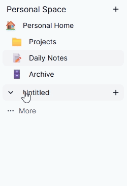

# TeamSpace

> 실시간 협업 편집 + 워크스페이스 권한/초대 시스템을 구현한 협업 SaaS 프로젝트

## 1) 프로젝트 소개

**TeamSpace**는 개인/팀 워크스페이스에서 문서를 계층형으로 관리하고,  
여러 사용자가 동시에 같은 문서를 편집할 수 있는 **실시간 협업 문서 플랫폼**입니다.

- 워크스페이스 기반 멤버십/권한(OWNER/MEMBER/VIEWER)
- 문서 트리(부모-자식) 구조 및 페이지 생성/탐색
- Liveblocks + BlockNote 기반 실시간 멀티 커서/공동 편집
- 페이지 공개 토글 및 토큰 기반 읽기 전용 공유 링크
- 초대/수락/거절 플로우
- 인증(NextAuth + Credentials/Google) 및 회원가입
- 스냅샷 기반 이전 버전 복구

---

## 2) 핵심 기능

### 인증 & 사용자

- NextAuth 기반 로그인 (Credentials + Google)
- 회원가입 시 개인 워크스페이스 자동 생성
- 비밀번호 해시 저장 (bcrypt)
- Cloudflare Turnstile 기반 봇 검증

### 워크스페이스

- `PERSONAL`, `TEAM` 타입 지원
- 워크스페이스 생성/이름 변경
- 멤버 역할 관리 (`OWNER`, `ADMIN`, `MEMBER`, `VIEWER`)
- 사이드바에 개인/팀 스페이스 분리 렌더링

### 페이지(문서) 시스템

- 페이지 트리 구조 (`parentId` 기반)
- 루트/하위 페이지 생성
- 제목/아이콘 수정
- 공개 여부 토글 (`ispublished`) + `publictoken` 공유

### 실시간 협업

- Liveblocks Room 단위로 페이지별 실시간 세션
- BlockNote 에디터와 연동해 동시 편집
- VIEWER는 읽기 전용, 그 외 FULL_ACCESS
- 비로그인 유저는 공개 페이지에 한해 게스트 읽기 권한

### 초대 시스템

- 이메일 prefix 기반 사용자 검색
- 워크스페이스 초대 생성
- 초대 수락 시 멤버십 자동 반영
- 거절/중복/자기초대 방지 처리

---

## 3) 기술 스택

- **Frontend**: Next.js 16 (App Router), React 19, TypeScript
- **UI**: Tailwind CSS v4, shadcn/ui
- **State/Data**: TanStack Query, Zustand
- **Auth**: NextAuth v5(beta), Prisma Adapter
- **DB/ORM**: PostgreSQL, Prisma
- **Realtime**: Liveblocks, BlockNote
- **Validation**: Zod, React Hook Form

---

## 4) 아키텍처 요약

```text
app/
  ├─ (protected)/dashboard/...        # 인증 사용자 영역
  ├─ share/[token]/...                # 공개 공유 문서(읽기 전용)
  ├─ api/...                          # Route Handlers(API)
server/
  ├─ users/queries.ts                 # 사용자/사이드바/접근 관련 DB 쿼리
  ├─ create/queries.ts                # 페이지/워크스페이스 생성 및 수정
  ├─ invite/queries.ts                # 초대 플로우
  ├─ page/queries.ts                  # 페이지 공개 토글/토큰 조회
lib/
  ├─ auth.ts                          # NextAuth 설정
  ├─ prisma.ts                        # Prisma 클라이언트
  ├─ api/*                            # 클라이언트 fetch 래퍼
prisma/
  ├─ schema.prisma                    # 데이터 모델
```

## 5) 이슈 및 트러블슈팅

<details>
  <summary>페이지 전환시 2200ms => 334ms 개선 </summary>

## 협업 에디터 성능 개선 사례

---

## 1. 프로젝트 개요

본 프로젝트는 Liveblocks를 활용한 실시간 협업 기능과  
BlockNote 에디터를 기반으로 한 문서 편집 시스템입니다.

각 문서는 pageId를 기준으로 하나의 Liveblocks room에 매핑되며,  
사용자가 문서를 전환할 때마다 새로운 room에 접속하여 협업 상태를 동기화합니다.

즉, 문서 이동은 단순한 화면 전환이 아니라  
새로운 협업 세션에 진입하는 구조입니다.

또한, CursorLayer를 통해 여러 사용자가 동일한 문서를 편집할 경우  
다른 사용자의 마우스 위치를 실시간으로 표시하는 기능을 제공합니다.

---

## 2. 문제 상황

협업 에디터 구현 이후, 문서 전환 시 다음과 같은 문제가 발생했습니다.

- 문서를 클릭해도 본문이 즉시 표시되지 않음
- 사용자 입장에서 “문서가 느리게 열린다”는 체감 발생
- 단순 렌더링 문제인지, 협업 동기화 문제인지 원인 파악이 어려움

---

## 3. 원인 분석 과정

### 가설 1. roomId 이중 초기화 문제

문서 전환 시 roomId가 두 번 변경되면서  
Liveblocks room이 불필요하게 재초기화될 가능성을 의심했습니다.

특히, URL 파라미터가 즉시 반영되지 않는 경우  
Zustand의 초기값 → 실제 pageId 순으로 변경되면서  
room 연결이 두 번 발생할 수 있다고 판단했습니다.

#### 검증 결과

- roomId는 한 번만 정상적으로 변경됨
- 이중 초기화는 발생하지 않음

### 가설 2. BlockNote editor 재생성 문제

렌더링 과정에서 editor 인스턴스가 반복 생성되는지 확인했습니다.

#### 검증 결과

- useCreateBlockNote는 useMemo 기반으로 동작
- dependency 변경 시에만 editor 재생성
- 로그 확인 결과 인스턴스 재생성 문제는 아니였음

---

## 4. 1차 해결 시도: 구조 분리

초기 분석 단계에서는 명확한 원인을 특정하기 어려웠기 때문에,  
우선 초기 렌더링 성능 개선에 집중했습니다.

> “문서 표시”와 “협업 기능”을 분리한다.

- Viewer: 빠른 초기 표시 담당
- Editor: 협업이 필요한 시점에만 활성화

이를 위해 다음과 같은 구조를 설계했습니다.

- DB에 문서 snapshot 저장
- 페이지 진입 시 snapshot 기반 Viewer를 먼저 렌더링
- 편집 시점에만 Liveblocks + Editor 마운트
- 협업 중 변경사항은 debounce 후 snapshot으로 저장

이 구조를 구현하던 도중,  
기존에 인지하지 못했던 추가적인 성능 병목을 발견하게 되었습니다.

---

## 5. 추가 병목 발견: CursorLayer

CursorLayer는 내부적으로  
BlockNoteView를 감싸는 DOM의 getBoundingClientRect()를 기반으로  
레이아웃을 계산하고 있었습니다.

그러나 1차 해결 시도를 하는 과정에서

CursorLayer를 잠시 비활성화했을 때  
room 진입 속도가 눈에 띄게 개선되는 것을 확인했습니다.

---

## 6. CursorLayer 성능 문제 분석

### 문제 증상

- 문서 최초 진입 시 로딩 속도 저하
- Liveblocks room 연결 지연
- 에디터 내용 표시까지 체감 지연 증가

### 1) 초기 로딩 시 비용 집중

문서 진입 직후 다음 작업이 동시에 수행되었습니다.

- room 연결
- storage sync
- editor 초기화
- presence 상태 동기화 (커서 포함)
- layout 계산

→ 초기 로딩 시점에 모든 비용이 집중됨

### 2. 실행 타이밍 문제

- provider 연결 이전에 useOthers() 호출
- 다른 사용자 정보가 없는 상태에서 접근 시도
- 일부 상황에서 null 관련 에러 발생

→ CursorLayer가 너무 이른 시점에 실행되고 있었음

---

## 7. 해결 전략

### 1) CursorLayer 지연 활성화

초기 진입 시 CursorLayer를 비활성화하고,  
일정 시간 이후 활성화하도록 변경했습니다.

성능 측정을 위해 Liveblocks의 ClientSideSuspense를 기준으로  
초기 로딩 시간을 계측한 결과,


협업 환경 초기화 시간: 약 2.2초

이를 기반으로 안전 여유를 포함하여  
3초 지연 후 CursorLayer를 활성화하도록 적용했습니다.

### 2. 고정 지연 방식의 한계

네트워크 환경에 따라 초기화 시간이 달라지기 때문에  
고정된 지연 방식은 상황에 따라 부정확하게 동작하는 문제가 있었습니다.

### 3. 최종 개선 방식

보다 안정적인 처리를 위해 다음과 같이 구조를 개선했습니다.

- Liveblocks에서 제공하는 에디터 준비 완료 상태를 알려주는 api를 활용
- 초기 레이아웃 계산 완료 여부까지 함께 고려
- Zustand 전역 상태로 준비 여부 관리

즉,

- editor 준비 완료
- layout 계산 완료

두 조건을 모두 만족한 시점에만 CursorLayer를 활성화하도록 변경했습니다.

---

## 8. 최종 구조 및 결과

최종적으로 다음과 같은 구조로 개선했습니다.

- Cursor 상태를 Zustand 전역 상태로 관리
- 페이지 이동 시 CursorLayer 강제 비활성화
- 새 페이지 진입 후 준비 상태 확인 후 활성화

### 결과


- 초기 문서 로딩 속도: 2200ms → 334ms 개선
- room 진입 속도: CursorLayer 비활성화 수준까지 회복

</details>

<details>
  <summary>문서 전환 시 Tree UI 깜빡임 문제를 상태 구조 개선으로 해결 </summary>

## 1. 문제 상황



사이드바의 Tree UI에서 문서를 전환할 때 flickering이 발생했습니다.  
특히 캐시되지 않은 상태에서는 다른 문서로 이동하는 순간 Tree가 잠시 비워졌다가 다시 렌더링되면서, 탐색 흐름이 끊겨 보이는 문제가 있었습니다.

- 캐시된 상태: 깜빡임 없음
- 캐시되지 않은 상태: 문서 전환 시 Tree UI가 순간적으로 비워졌다가 다시 렌더링됨

---

## 2. 원인 추적 과정

초기에는 React Query의 refetch나 조건부 렌더링이 주요 원인이라고 의심했습니다.  
하지만 검증 결과, 이들은 현상을 일부 악화시키는 요소일 뿐 근본 원인은 아니었습니다.

### 1) React Query refetch 영향 확인

문서 전환 시 React Query의 refetch가 발생하면서 Tree 컴포넌트의 재렌더링을 유발한다고 판단했습니다.  
이를 검증하기 위해 staleTime을 늘려 캐시 재사용 시간을 확보하고, 불필요한 요청을 줄였습니다.

> **ancestorPath**: 현재 문서까지의 상위 노드 경로를 담은 배열

결과적으로 같은 ancestorPath를 공유하는 문서 간 전환에서는 깜빡임이 완화되었지만, 근본적인 해결책은 아니었습니다.

### 2) 조건부 렌더링 영향 확인

데이터가 준비되지 않은 시점에 컴포넌트가 사라지면서 Tree UI가 순간적으로 비워질 가능성을 확인했습니다.  
이에 따라 컴포넌트 자체는 유지하고, optional chaining으로 데이터 접근만 안전하게 처리했습니다.

결과적으로 UI 공백은 일부 줄었지만 flickering 자체는 여전히 발생했습니다.

### 3) 상태 구조 문제 분석

최종적으로 확인한 핵심 원인은 ancestorPath 전달 방식이었습니다.  
기존에는 ancestorPath를 props로 하위 컴포넌트에 전달했는데, 문서를 클릭할 때마다 새로운 배열 인스턴스가 생성되었습니다.  
React는 배열의 참조값이 바뀌면 새로운 값으로 인식하기 때문에, 이 과정에서 Tree 전체가 다시 렌더링되며 flickering이 발생했습니다.

---

## 3. 구조 개선

기존 구조에서는 현재 문서의 ancestorPath에 해당하는 노드만 열리고, 다른 문서를 클릭하면 이전에 열려 있던 노드가 모두 닫혔습니다.  
하지만 사용자 입장에서는 이미 열어둔 노드가 문서 이동 이후에도 유지되는 편이 더 자연스러운 UX라고 판단했습니다.

처음에는 zustand와 Set을 활용해 open 상태를 관리하는 방식을 고려했습니다.  
다만 Set은 특정 노드의 open 여부를 관리하기에는 적합하지만, 이후 노드별 상태를 확장하거나 추가 정보를 함께 관리하기에는 한계가 있다고 판단했습니다.  
또한 ancestorPath 기반으로 열린 노드뿐 아니라, 사용자가 직접 연 노드도 함께 유지할 필요가 있었습니다.

이 때문에 최종적으로는 객체(Object) 기반 상태 관리를 선택했습니다.

- 열려 있는 노드를 객체의 key로 관리
- 새 문서를 선택해도 기존 open 상태 유지
- 문서 전환 시 필요한 노드만 추가로 open 처리

이 구조로 변경하면서 Tree의 open 상태를 보다 안정적으로 관리할 수 있게 되었습니다.

---

## 4. 추가 이슈 및 최종 해결

구조를 변경한 이후에도 flickering이 완전히 사라지지는 않았고, open/close 동작이 간헐적으로 불안정한 문제가 남아 있었습니다.

원인을 추적한 결과, open 상태를 의존성으로 둔 useEffect가 상태 변경 때마다 다시 실행되면서 ancestorPath 기반 초기화 로직이 반복 적용되고 있었습니다.  
그 결과 상태가 계속 덮어써졌고, 불필요한 렌더링이 반복되면서 UI가 불안정해졌습니다.

이를 해결하기 위해 초기화 로직과 상태 변경 로직을 분리했습니다.

- 초기 진입 시에만 ancestorPath를 기준으로 open 상태를 초기화
- 이후에는 사용자 액션을 통해서만 상태를 변경

이렇게 분리한 뒤에는 불필요한 상태 업데이트가 사라졌고, open/close 동작도 안정화되었습니다.

---

## 5. 결과

- 문서 전환 시 Tree UI flickering 현상 제거
- 기존에 열어둔 노드의 open 상태 안정적으로 유지
- open/close 동작의 간헐적 오작동 해소
- 불필요한 재렌더링 감소로 문서 탐색 UX 개선
  </details>

<details>
  <summary>Next.js App Router에서 브라우저 의존 라이브러리(BlockNote) 사용 시 window is not defined 문제와 해결 </summary>

## 개요

Next.js App Router 환경에서 **BlockNote + Liveblocks 기반 에디터**를 적용하던 중,  
브라우저 전용 API 접근으로 인해 런타임 에러가 발생했습니다.

---

## 에러 메시지

```bash
Runtime Error: window is not defined
```

---

## 문제 원인

초기에는 `'use client'`를 선언하면 해당 컴포넌트가 완전히 클라이언트 전용으로 동작하므로, 브라우저 관련 코드는 서버에서 실행되지 않을 것이라고 생각했습니다.

하지만 실제로는 그렇지 않았습니다.

> [!IMPORTANT]
> Next.js App Router에서 `'use client'`는 해당 파일을 **Client Component로 지정하는 역할**을 합니다.  
> 다만, 브라우저 전용 라이브러리의 모든 초기화 과정이 서버와 완전히 분리된다는 것까지 보장하지는 않습니다.

### 충돌이 발생할 수 있는 대표적인 경우

- 라이브러리가 **import 시점**에 `window`, `document`를 참조하는 경우
- 훅 호출 또는 초기화 과정에서 브라우저 API에 접근하는 경우
- 외부 라이브러리 자체가 **SSR-safe 하지 않은 경우**

### 이번 케이스에서의 원인

BlockNote는 내부적으로 `window`, `document` 등 브라우저 API에 의존하고 있었으며,  
에디터 초기화 로직 또한 브라우저 환경을 전제로 동작했습니다.

그 결과, 관련 코드가 **서버 렌더링 또는 서버 평가 경로**에서 안전하게 처리되지 못했고, 최종적으로 아래 에러가 발생했습니다.

```bash
ReferenceError: window is not defined
```

> [!NOTE]
> 즉, `'use client'`를 사용했다고 해서 브라우저 전용 코드가 항상 클라이언트에서만 안전하게 실행된다고 볼 수는 없습니다.  
> 라이브러리의 초기화 시점과 import 구조에 따라 SSR 경로와 충돌할 수 있습니다.

---

## 해결 방법

문제의 핵심은 `window` 체크 자체가 아니라,  
**브라우저 의존성이 강한 에디터 컴포넌트를 SSR 경로에서 완전히 분리하는 것**이었습니다.

이를 위해 Next.js의 `dynamic import`를 사용해 에디터 컴포넌트를 클라이언트에서만 로드하도록 변경했습니다.

```tsx
import dynamic from 'next/dynamic';

const Editor = dynamic(() => import('../../Editor').then((m) => m.Editor), {
  ssr: false,
});
```

### 왜 이 방식이 필요한가요?

`ssr: false`를 설정하면 해당 컴포넌트는 **서버 렌더링 대상에서 제외**됩니다.  
따라서 브라우저 환경이 보장된 이후에만 로드되며, `window`나 `document`를 사용하는 라이브러리와의 충돌을 방지할 수 있습니다.

> [!TIP]
> BlockNote처럼 브라우저 API 의존성이 큰 라이브러리에는 `dynamic import + ssr: false` 방식이 가장 안전합니다.

---

## 결과

- `window is not defined` 에러 해결
- BlockNote + Liveblocks 에디터 정상 동작
- SSR 환경과 브라우저 전용 로직을 명확히 분리하는 구조로 개선

---

## 최종 정리

이번 이슈를 통해 확인한 핵심은 다음과 같습니다.

### 핵심 포인트

- `'use client'`는 **Client Component 선언**을 위한 것입니다.
- 하지만 브라우저 API를 사용하는 외부 라이브러리의 SSR 안전성까지 보장하지는 않습니다.
- 따라서 브라우저 의존성이 강한 라이브러리는 아래 항목을 반드시 함께 검토해야 합니다.

### 체크리스트

- 해당 라이브러리가 **SSR 환경에서 안전하게 동작하는지**
- **import 시점**에 브라우저 객체를 참조하지 않는지
- 필요하다면 `dynamic import` + `ssr: false`로 **완전히 클라이언트 전용으로 분리해야 하는지**

---

## 결론

이번 문제는 단순히 `'use client'`를 선언하는 것만으로 해결되는 문제가 아니었습니다.

BlockNote처럼 브라우저 환경에 강하게 의존하는 라이브러리는,  
필요한 경우 `dynamic import`와 `ssr: false`를 사용하여 **SSR 렌더링 경로에서 명확히 분리**해야 안정적으로 동작합니다.

</details>

<details>
  <summary>실시간 협업 커서 위치 오차 문제 해결 </summary>

## 1. 문제 상황

실시간 협업 에디터에서 다른 사용자의 커서를 표시하는 기능을 구현하는 과정에서,  
**같은 마우스 위치임에도 사용자마다 커서 위치가 다르게 보이는 문제**가 발생했습니다.

에디터는 화면 중앙 정렬 구조였고, 각 사용자의 브라우저 너비에 따라 좌우 `margin` 값이 달라졌습니다.  
이로 인해 동일한 `viewport` 좌표를 기준으로 계산하더라도, 실제 에디터 내부 기준 좌표는 사용자마다 다르게 계산되었습니다.

결과적으로, **같은 위치를 가리키더라도 커서가 서로 다른 위치에 표시되는 문제**가 발생했습니다.

---

## 2. 초기 접근과 한계

초기에는 다음과 같은 방식으로 구현했습니다.

- `viewport` 기준 좌표에서 네비게이션 영역을 제외했습니다.
- 남은 값을 비율로 변환하여 다른 사용자 화면에서 복원했습니다.

이 방식은 단순하고 직관적으로 보였지만, 근본적인 한계가 있었습니다.

- 좌표 기준이 **에디터가 아닌 전체 화면(`viewport`)** 이었습니다.
- 브라우저 크기나 모니터 환경이 다르면 비율 기반 복원에서도 오차가 누적되었습니다.

즉, 이 방식은 좌표계를 올바르게 설정한 것이 아니라,  
**잘못된 좌표계를 기준으로 보정만 시도한 구조**였습니다.

---

## 3. 해결 방향: 좌표계를 에디터 기준으로 재정의

문제를 해결하기 위해 좌표 기준을 `viewport`가 아닌  
**에디터 영역(`rect`) 기준으로 변경**했습니다.

이를 위해 다음과 같은 방법을 적용했습니다.

- `ResizeObserver`
- `scroll` 이벤트
- `resize` 이벤트

위 이벤트들을 활용해 에디터의 `bounding rect`가 변할 때마다 기준 영역을 갱신하고,  
커서 좌표를 **에디터 기준 상대 좌표**로 계산 및 전송하도록 수정했습니다.

이 방식으로 변경한 뒤 다음과 같은 효과를 얻을 수 있었습니다.

- 브라우저 크기가 달라도 동일한 기준을 유지할 수 있었습니다.
- 스크롤 상황에서도 정확하게 위치를 복원할 수 있었습니다.
- 사용자 환경 차이로 인해 발생하던 좌표 오차를 제거할 수 있었습니다.

---

## 4. 성능 문제: state 기반 rect 관리의 한계

좌표 기준 문제를 해결한 이후에는 새로운 문제가 발생했습니다.  
에디터의 `rect` 값을 React `state`로 관리하면서 **리렌더링이 과도하게 발생**한 것입니다.

### 문제 상황

- `scroll` 또는 `resize`가 발생할 때마다 `rect` 값이 계속 변경되었습니다.
- `state` 업데이트가 발생하면서 컴포넌트 리렌더링이 유발되었습니다.
- 결과적으로 커서 위치가 바뀔 때마다 렌더링 비용이 급격히 증가했습니다.

특히 다음과 같은 구조가 문제였습니다.

- `EditorWrapper` 내부에서 `<Editor />`를 직접 생성하고 있었습니다.
- `EditorWrapper`의 `state`가 변경될 때마다 `Editor`도 함께 재생성되었습니다.

React에서는 element 참조가 바뀌면 해당 subtree 전체가 reconciliation 대상이 되기 때문에,  
실제로는 관련 없는 변경에도 **불필요한 리렌더링이 발생**하게 되었습니다.

---

## 5. 구조 개선: 참조 안정성 확보

이 문제를 해결하기 위해 컴포넌트 구조를 변경했습니다.

- `<Editor />`를 `children`으로 외부에서 생성하도록 변경했습니다.
- `EditorWrapper`는 wrapper 역할만 수행하도록 단순화했습니다.

핵심은 `children` 패턴 자체가 최적화 기법이라는 점이 아니라,  
**자식 element의 생성 위치를 상위로 이동시켜 참조 안정성을 확보한 것**입니다.

이 변경을 통해 `Editor`의 불필요한 리렌더링을 차단할 수 있었습니다.

---

## 6. 추가 최적화: state 제거와 렌더링 비용 감소

구조를 개선한 이후에도 `rect` 값을 계속 `state`로 관리하는 방식은 여전히 부담이 있었습니다.  
그래서 상태 관리 방식 자체를 다시 검토했습니다.

### 변경 내용

- `rect` 관련 값은 React `state` 대신 **CSS Custom Property**로 관리했습니다.
- 커서 위치 이동에는 `transform: translate3d(...)`를 사용했습니다.

### 적용 효과

- React `state` 업데이트를 제거하여 리렌더링을 최소화할 수 있었습니다.
- GPU 가속을 활용해 커서 이동이 더 부드럽게 동작했습니다.
- 메인 스레드 부담이 줄어들어 체감 성능이 개선되었습니다.

결과적으로, 커서 이동이 이전보다 훨씬 자연스럽고 안정적으로 동작하게 되었습니다.

---

## 7. 모바일 환경 이슈와 대응

마지막으로 모바일 환경에서는 또 다른 문제가 발생했습니다.

- 화면 너비가 좁아지면서 텍스트가 다음 줄로 넘어갔습니다.
- 같은 좌표를 가리키더라도 실제로는 서로 다른 글자 위치를 가리키게 되었습니다.

이 문제는 단순한 좌표 계산의 문제가 아니라,  
**레이아웃 자체가 달라지는 문제**였습니다.

### 판단

모든 사용자에게 동일한 텍스트 위치를 보장하려면,  
기본적으로 동일한 레이아웃 조건이 필요했습니다.

하지만 모바일 환경까지 완전히 지원하려면 줄바꿈, 폭, 텍스트 흐름까지 함께 맞춰야 했고,  
구현 복잡도가 크게 증가했습니다.

### 결론

그래서 다음과 같이 방향을 정리했습니다.

- 에디터의 `width`를 고정했습니다.
- 기능 지원 범위를 데스크톱 환경으로 제한했습니다.

이를 통해 모든 사용자에게 동일한 기준 좌표를 적용할 수 있었고,  
최종적으로 좌표 복원 정확도를 안정적으로 확보할 수 있었습니다.

---

## 8. 최종 결과

최종적으로 다음과 같은 결과를 얻었습니다.

- 에디터 기준 좌표계로 기준을 통일했습니다.
- `resize` / `scroll` 상황에서도 안정적으로 위치를 복원할 수 있었습니다.
- React 리렌더링을 최소화했습니다.
- GPU 가속 기반으로 부드러운 커서 이동을 구현했습니다.

결과적으로,  
**사용자 환경 차이에도 불구하고 정확하고 자연스러운 실시간 협업 커서 기능을 구현할 수 있었습니다.**

---

## 9. 핵심 정리

이 문제의 본질은 단순한 좌표 오차가 아니라, 다음 세 가지가 복합적으로 얽혀 있는 문제였습니다.

- 잘못된 좌표계 선택 (`viewport` 기준)
- 상태 관리 방식으로 인한 렌더링 비용 증가
- 사용자 환경에 따른 레이아웃 불일치

그리고 이를 해결한 핵심은 다음과 같습니다.

- 좌표계를 **에디터 기준으로 재정의**했습니다.
- 참조 안정성을 확보하여 **불필요한 리렌더링을 제거**했습니다.
- `state` 대신 **CSS + `transform` 기반으로 렌더링을 최적화**했습니다.

이번 작업을 통해, 단순히 좌표 계산 로직만 수정하는 것이 아니라  
**좌표계, 렌더링 구조, 레이아웃 조건까지 함께 고려해야 실시간 협업 기능을 안정적으로 구현할 수 있다는 점**을 확인할 수 있었습니다.

</details>
